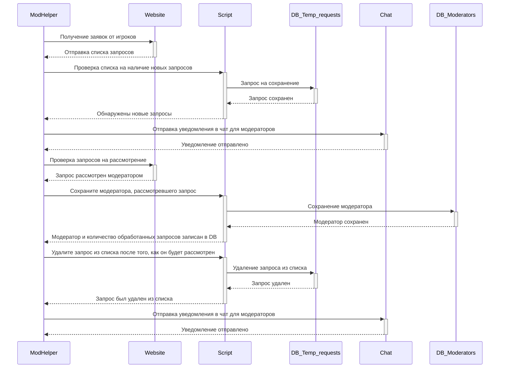

[EN](README.md) | RU

# ModHelper (чат-бот)

В 2019 году я разработал чатбот в качестве своего первого значимого индивидуального проекта. С тех пор он работает без сбоев. Основная задача чатбота - автоматизировать и упростить обработку и мониторинг запросов игроков на разблокировку аккаунтов в двух разных игровых проектах.

Бот предназначен для анализа запросов на разблокировку аккаунтов на всех серверах игрового проекта и оперативного оповещения соответствующих модераторов для принятия оперативных мер. Это важно, так как команды модераторов в этих проектах могут пересекаться.

<b>📄 Диаграмма последовательности чат-бота</b>

  

  

<b>🖼️ Скриншоты</b>

  

 
  <b>Изображение 1</b> - На сайт игрового проекта поступил новый запрос. Уведомление об этом было отправлено в чат модераторов.

  

 
  <b>Изображение 2</b> - После того как запрос будет выполнен, в чат модератора будет отправлено уведомление.

  

 
  <b>Изображение 3</b> - Скриншот данных с сайта игрового проекта.

  

 
  <b>Изображение 4</b> - Команда "/bot_stats" отображает список модераторов, отсортированный в порядке убывания.

## 🎯 Основные функции и задачи:
- **Сбор и анализ данных:** Сбор и анализ данных по запросам на разблокировку аккаунтов игроков на обоих официальных сайтах игровых проектов. 
- **Уведомление модераторов:** Автоматически уведомляйте модераторов через мессенджер о новых запросах, требующих их вмешательства.
- **Оптимизация рабочего процесса:** Упростить и ускорить работу модераторов.
- **Сокращение времени ожидания:** Сократите время, необходимое для получения ответа на запросы о разблокировке.

## 📊 Дополнительные функциональные возможности:
- **Список топа модераторов:** Бот формирует таблицу лидеров среди модераторов игровых проектов в зависимости от количества запросов, с которыми они справились. Это помогает распределять нагрузку и следить за эффективностью.
- **Черный список Steam ID:** Система включает в себя функцию черного списка, в котором хранятся Steam ID игроков, не подлежащих разбану. Модераторы получают немедленные уведомления о запросах на разбан по этим идентификаторам, что предотвращает возможные ошибки.

## 📜 Список команд
- Чтобы добавить SteamID в черный список, используйте `/add_steam_id <SteamID>`.
- Чтобы удалить SteamID из черного списка, используйте `/delete_steam_id <SteamID>`.
- Чтобы получить список SteamID, внесенных в черный список, используйте `/list`.
- Чтобы получить список модераторов, используйте `/bot_stats`.
- Чтобы включить уведомления о новых запросах, используйте `/on` (для модератора, который ввел эту команду).
- `/off` - отключить уведомления о новых заявках (для модератора, который ввел эту команду).

## 🛠️ Используемые библиотеки и модули:
- **vk_api:** Обеспечивает взаимодействие с API социальной сети VK.
- **requests:** Обеспечивает обработку HTTP-запросов и извлечение данных с веб-страниц.
- **bs4 (Beautiful Soup):** Обеспечивает парсинг HTML-контента и извлечение данных.
- **telebot:** Обеспечивает бесшовную интеграцию с мессенджером Telegram для уведомлений модераторов.
- **pytz:** Обеспечивает эффективное управление часовыми поясами и обработку временных меток в проекте
