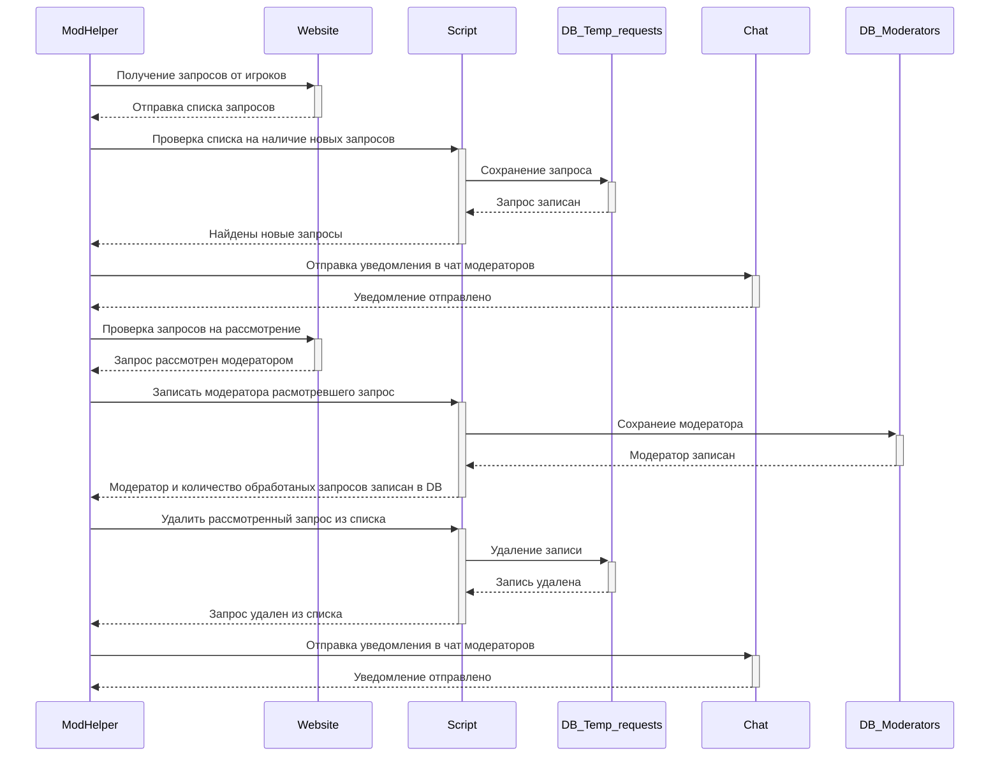

[EN](README.md) | RU

# 🦉 ModHelper - Chat-bot for monitoring a game project

  

<b>Диаграмма последовательности чат-бота</b>

  

Разработанный в 2019 году, этот чат-бот является моим первым крупным индивидуальным проектом, который на сегодняшний день успешно функционирует без сбоев. Проект предназначен для автоматизации процесса обработки и мониторинга запросов игроков на разблокировку аккаунтов в двух различных игровых проектах.

Учитывая потенциальное дублирование команд модераторов в этих проектах, бот разработан таким образом, чтобы анализировать запросы на разблокировку аккаунтов на всех серверах игрового проекта, оперативно уведомляя соответствующих модераторов для принятия быстрых мер.

## Основные функции и задачи:
- **Сбор и анализ данных:** Автоматический сбор и анализ запросов игроков на разблокировку аккаунтов с официальных сайтов двух игровых проектов.
- **Уведомление модераторов:** Автоматическое уведомление модераторов через мессенджер о новых запросах, требующих их вмешательства.
- **Оптимизация рабочего процесса:** Улучшение эффективности работы модераторов и сокращение времени ожидания ответов игроков.

## Дополнительные функциональные возможности:
- **Список топа модераторов:** Автоматическое формирование списка модераторов с отображением количества обработанных запросов.
- **Черный список Steam ID:** Функциональность черного списка для предотвращения разблокировки аккаунтов определенных игроков.

## Преимущества проекта:
- **Оптимизация рабочего процесса:** Упрощение и ускорение работы модераторов.
- **Сокращение времени ожидания:** Снижение времени ожидания ответа игроков на запросы о разблокировке.

## Используемые библиотеки и модули:
- **vk_api:** Для взаимодействия с API социальной сети VK.
- **requests:** Для отправки HTTP-запросов и получения данных с веб-страниц.
- **bs4 (Beautiful Soup):** Для парсинга и извлечения данных из HTML-контента.
- **telebot:** Для интеграции с мессенджером Telegram и отправки уведомлений модераторам.
- **pytz:** Для работы с часовыми поясами и временными зонами в проекте.
