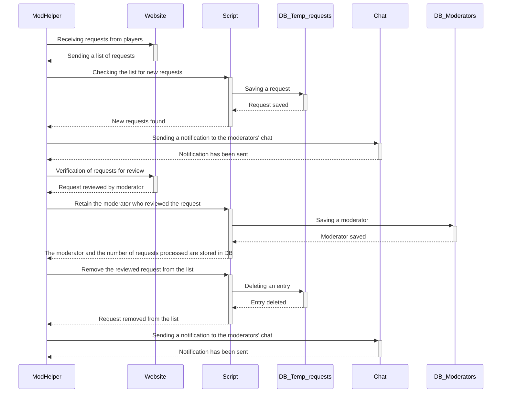

EN | [RU](README-ru.md)

# 🦉 ModHelper - Chatbot for monitoring a game project

  

<b>Sequence diagram chatbot</b>

Developed in 2019, this chatbot stands as my inaugural significant individual project, boasting seamless functionality up to the present day. The primary objective is to automate and streamline the handling and monitoring of player requests for account unlocks across two distinct gaming projects.

Given the potential overlap in moderator teams across these projects, the bot is intricately designed to analyze account unlocking requests across all gaming project servers, promptly notifying the relevant moderators for swift action.

## Primary Tasks and Features

- **Data Collection & Analysis:** Compiles and analyzes data from players' account unlock requests from the official websites of both gaming projects.
  
- **Automated Notifications:** Sends instant notifications to moderators via a chosen messenger concerning new requests that necessitate their intervention across all server instances.

- **Workflow Enhancement:** Aims to optimize moderator tasks, increasing overall productivity, and reducing response times for player account unlocking requests.

## Additional Functionalities

- **Moderator Leaderboard:** The bot dynamically generates a leaderboard of gaming project moderators, reflecting the volume of requests each has managed. This aids in workload distribution and efficiency monitoring.
  
- **Steam ID Blacklist:** Incorporates a blacklist functionality housing Steam IDs of specific players who should not be unlocked. Instant notifications are dispatched to moderators upon detecting any unban requests for these IDs, preventing potential errors.

## Advantages

- **Optimized Workflow:** Significantly streamlines and accelerates moderator tasks, ensuring prompt responses to critical player requests.
  
- **Reduced Waiting Period:** Minimizes the waiting time for users awaiting account unlock responses, enhancing overall user satisfaction.

## Libraries and Dependencies

- **vk_api:** Facilitates interaction with the VK social network API.
  
- **requests:** Enables HTTP request handling and data retrieval from web pages.
  
- **bs4 (Beautiful Soup):** Empowers HTML content parsing and data extraction.
  
- **telebot:** Enables seamless integration with Telegram messenger for moderator notifications.
  
- **pytz:** Ensures efficient time zone management and timestamp handling within the project.
