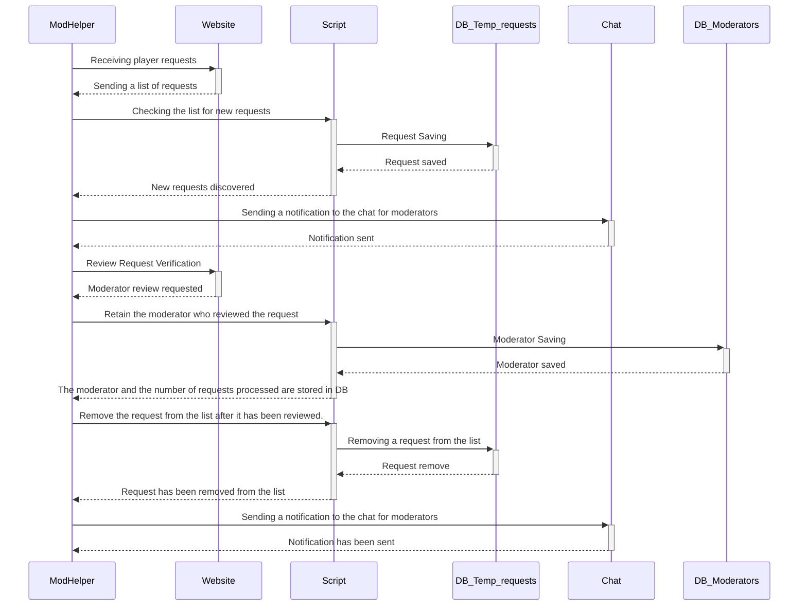

EN | [RU](README-ru.md)

# ModHelper (chatbot)

In 2019, I developed a chatbot as my first significant individual project. It has been functioning seamlessly ever since. The main goal of the chatbot is to automate and streamline the handling and monitoring of player requests for account unlocks in two different gaming projects.

The bot is designed to analyze account unlocking requests across all gaming project servers and promptly notify the relevant moderators for swift action. This is important because there may be overlap in moderator teams across these projects.

  

<b>📄 Chatbot Sequence Diagram</b>

  

<b>🖼️ Screenshots</b>

  

 
  <b>Image 1</b> - The game project site has received a new request. A notification has been sent to the moderators' chat.

  

 
  <b>Image 2</b> - After the request has been completed, a notification will be sent to the moderator chat.

  

 
  <b>Image 3</b> - Data screenshot from the game project website.

  

 
  <b>Image 4</b> - The command "/bot_stats" displays a list of moderators sorted in descending order.

## 🎯 Primary Tasks and Features

- **Data Collection and Analysis:** Collect and analyze data from player account unlock requests on both official websites of the gaming projects. 
- **Moderator Notification:** Notify moderators automatically via messenger of new requests requiring their intervention.
- **Workflow Optimization:** Simplify and expedite the work of moderators.
- **Reduce waiting time:** Minimize the time it takes to receive a response for unlocking requests.

## 📊 Additional Functionalities

- **Moderator Leaderboard:** The bot generates a leaderboard of gaming project moderators based on the number of requests they have managed. This helps distribute workload and monitor efficiency.
- **Steam ID Blacklist:** The system includes a blacklist feature that stores Steam IDs of players who should not be unbanned. Moderators receive immediate notifications when unban requests are made for these IDs, preventing any potential errors.

## 📜 Command list

- To add a SteamID to the blacklist, use `/add_steam_id <SteamID>`.
- To remove a SteamID from the blacklist, use `/delete_steam_id <SteamID>`.
- To get a list of blacklisted SteamIDs, use `/list`.
- To get a list of moderators, use `/bot_stats`.
- To enable notifications of new requests, use `/on` (for the moderator who entered this command).
- `/off` - Disable notifications for new requests (for the moderator who entered this command).

## 🛠️ Libraries and Dependencies

- **vk_api:** Facilitates interaction with the VK social network API.
- **requests:** Enables HTTP request handling and data retrieval from web pages.
- **bs4 (Beautiful Soup):** Empowers HTML content parsing and data extraction.
- **telebot:** Enables seamless integration with Telegram messenger for moderator notifications.
- **pytz:** Ensures efficient time zone management and timestamp handling within the project.
